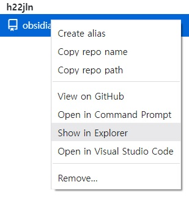

1. 사이트(https://github.com/maximevaillancourt/digital-garden-jekyll-template)에서 Use this Template > Create a new repository 로 내 github에 가져온다.
	
	이 과정에서 deploy가 실패했는데,
	
	
	
	Settings > Pages > Source를 Github Actions로 변경하고
	
	 
	 Re-run jobs로 재실행해주면
	
	
	deploy가 성공했음을 확인할 수 있다

2. [[https://desktop.github.com/||Github Desktop]] 설치

3. Github Desktop으로 1에서 생성한 repository clone
	File > Clone repository
	
	*클론된 폴더 위치는 레포지토리 우클릭 > Show in Explorer로 확인 가능*
	

4. [[https://www.netlify.com/||Netlify]] 회원가입 (Github 계정 연동)

5. Sites > Import from Git으로 1에서 만든 repository 가져옴
	
	
	
	
	Deploy with GitHub 선택
	
	
	
	1에서 만든 repository 선택 후
	
	
	Deploy 클릭

	
	조금 기다리면 Deploy 되었다는 알림이 뜬다
	

6. Site Configuration > Change sitename 으로 이름을 변경
	
	*특수문자 사용 불가*
	
	 
	
	잘 변경 되었다

7. Netlify를 통해 생성한 페이지(https://h22jlnsobsidian.netlify.app/)로 가보면 잘 생성되었음을 확인할 수 있다
	

8. 3에서 확인한 클론된 폴더 내부에 있는 \_notes 폴더에 publish 하고자 하는 옵시디언 노트 파일(.md)들을 넣어주고, Github Desktop을 사용해서 commit / push를 한다.

9. 7에서 생성한 페이지의 메인 페이지는 \_pages 폴더 내의 index.md 파일이다.
	index.md 파일을 수정 후 Github에 commit / push 한다.
	
	그 후 Netlify > Deploy를 확인해보면
	
	
	commit / push 한 내용이 나오고, 자동으로 Published 되었다.
	
	
	페이지도 잘 반영되었다.

*참고 (https://secondbrain.analysisman.com/Atlas/1_WRITE/1_Obsidian/%EC%98%B5%EC%8B%9C%EB%94%94%EC%96%B8+%EB%AC%B4%EB%A3%8C%EB%A1%9C+%ED%8D%BC%EB%B8%94%EB%A6%AC%EC%8B%9C%ED%95%98%EB%8A%94+%EB%B0%A9%EB%B2%95)*
